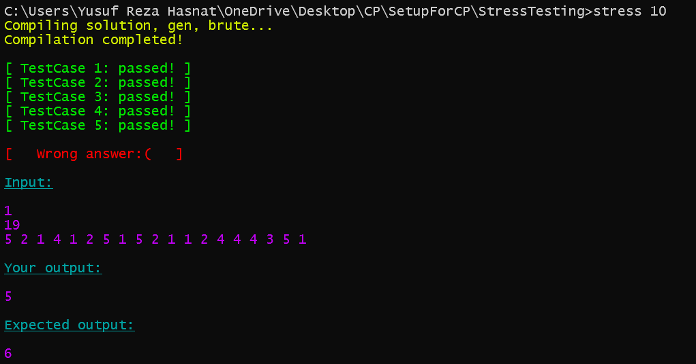
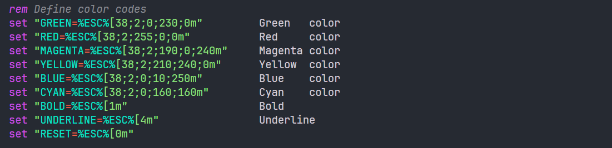

<h1 align="center">BugCom Prototype</h1>

Here are the steps to run the prototype of BugCom:

---

<h1 align="center">Step 1: Generate Brute Force Solution</h1>

When generating a brute force solution for competitive programming problems, use the following prompt template with ChatGPT's reasoning model:

### Prompt Template

```
Can you provide me with a brute force solution for this problem in C++? It should be a pure naive approach. I want it to pass all sample test cases.

[Insert your problem statement here with time and memory constraint. Include sample test cases too]
```

### Example Usage

```
Can you provide me with a brute force solution for this problem in C++? It should be a pure naive approach. I want it to pass all sample test cases.

Problem: Given an array of n integers, find the maximum sum of any subarray.

Input: First line contains n, second line contains n integers
Output: Maximum subarray sum

Sample Input:
5
-2 1 -3 4 5

Sample Output:
9
```

---

<h1 align="center">Step 2: Stress Testing</h1>

A simple script which stress tests our solution with a brute force solution on randomly generated testcases, to find a possible failing testcase.<br>

### Usage

Open the directory and you will see 3 cpp files and 1 bat file in StreeTesting directory.

1. **brute.cpp** (for brute force solution)
2. **solution.cpp** (for optimized solution)
3. **gen.cpp** (for generating test cases)
4. **stress.bat** (for testing our code)

### How to generate test cases

To generate test cases, we can use the gen.cpp file. We just edit this `generate_test()` function as per our requirement.<br>

1. We need an array of size n;

```cpp
void generate_test() {
    int n = rand(1, 100);
    // it will return an interger in the range [1, 100]
    cout << n << endl; // if you want to print the size of the array
    cout << gen_array(n, -100, 100) << endl;
    // it will return a vector with length n and elements in the range [-100, 100].
}
```

2. We need a tree with n nodes;

```cpp
void generate_test() {
    int n = rand(1, 100);
    cout << n << endl; // if you want to print the size of the tree
    cout << gen_tree(n) << endl;
    // it will return a tree with n nodes.
}
```

3. We need a simple graph with n nodes and m edges;

```cpp
void generate_test() {
    int n = rand(1, 100);
    int m = rand(1, 100);
    cout << n << " " << m << endl; // if you want to print the no of nodes and edges
    cout << gen_simple_graph(n, m) << endl;
    // it will return a simple connected graph with n nodes and m edges.
}
```

You can modify this file to generate test cases as per your requirements.

### How to use the script

1. Before running the script change **brute.cpp**, **solution.cpp**, and **gen.cpp** as per your requirement.
2. Open **Command Prompt** in **StressTesting** directory.
3. To run the script 10 time, type `stress 10` in your **Command Prompt**.

Here is an example of the output of the script. It shows our solution.cpp file gives wrong ans in test case 6.<br>


In script you can change the color of the output as per your requirement. Just change the color code in the script. All the color codes are given in the script as shown below.<br>


To change color just change the color code in the script as shown below.

```bash
#Replace the colorName with the color you want to use.
call :echoColorName
#e.g. we want to change the color from red to green
call :echoGreen
```

---

<h1 align="center">Step 3: Debug Failed Test Cases</h1>

After stress testing reveals a failing test case, use this prompt template to debug your optimized solution:

### Debugging Prompt Template

```
This is my code. I have failed in test case:

Input:
[Insert the failing test case input here]

Output:
[Insert your code's output here]

Expected Output:
[Insert the correct expected output here]

[Insert your complete C++ code here]

Can you debug my code? Make sure it passes all test cases, including edge cases.
```

### Example Debugging Usage

```
This is my code. I have failed in test case:

Input:
4
1 2 3 4

Output:
2

Expected Output:
3

#include <iostream>
#include <vector>
using namespace std;

int main() {
    int n;
    cin >> n;
    vector<int> arr(n);
    for(int i = 0; i < n; i++) {
        cin >> arr[i];
    }

    int result = 0;
    for(int i = 0; i < n-1; i++) {
        result += abs(arr[i] - arr[i+1]);
    }

    cout << result << endl;
    return 0;
}

Can you debug my code? Make sure it passes all test cases, including edge cases.
```

This approach ensures you get a reliable brute force solution that can be used as a baseline for stress testing your optimized solution, and effective debugging when issues are found.
